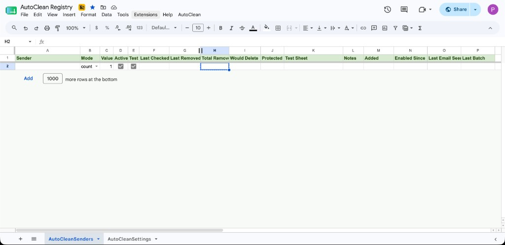

# Gmail AutoClean

Automatically keep only the newest newsletters, promotional emails, journals, recurring notifications, and other low-value email while protecting everything important.

Instead of manually deleting hundreds (or thousands) of old emails, AutoClean learns which senders you want to manage and automatically applies customizable retention rules.

[](https://ko-fi.com/S0P222IKZ9)

---

# Features

- 📬 Learn new senders with a Gmail label
- 🧹 Keep only the newest **N** emails
- 📅 Keep emails from the last **N** days
- ⚙️ Individual rules per sender
- 🧪 Per-sender Test Mode
- 🔒 Global Dry Run
- ⭐ Never delete starred emails
- 🏷 Never delete emails marked with **AutoClean/Keep**
- 🚫 Autoclean/Ignore to ignore senders completely
- 📈 Automatic statistics
- 📄 Detailed test reports
- 🔗 Direct Gmail links to every reviewed email
- 📆 Tracks when a rule was enabled
- 📬 Tracks the last email seen from every sender
- ⏰ Automatic scheduled cleanup
- 📋 Custom spreadsheet menu
- 🚀 Automatically creates and maintains its own registry spreadsheet/dashboard
- 🔁 Automatically batches cleanup to support hundreds of senders
- 🧾 Last Checked tracking
- 🧩 Last Batch tracking
- ⚡ Manual full cleanup option
- ♻️ Cleans existing inbox history, not just future emails

---

# Installation

## Recommended Install: Make a Copy

The easiest way to install Gmail AutoClean is to make a copy of the template spreadsheet:

[Make a copy of AutoClean Registry](https://docs.google.com/spreadsheets/d/1lF6n_nuEwqy8wGQCoxa9FsyDAvjaCSJ4bGuHkfdwPjk/copy)

After copying:

1. Open the copied spreadsheet.
2. Reload it if needed.
3. Use `AutoClean → Create Labels`.
4. Use `AutoClean → Run Cleanup - Next Batch`.
5. Approve the requested permissions.
6. Start labeling Gmail messages with:
   - `AutoClean/Learn`
   - `AutoClean/Keep`
   - `AutoClean/Ignore`
  

## Manual Install

## Step 1

Create a new Google Spreadsheet.

---

## Step 2

Open

```
Extensions
→ Apps Script
```

---

## Step 3

Paste:

- AutoClean.gs

---

## Step 4

Save the project.

---

## Step 5

Run **AutoClean → Run Cleanup - Next Batch** (or **Run Full Cleanup**) once to initialize AutoClean and grant permissions.

You can also run `keepLatestOnly()` once from the Apps Script editor.

Grant Gmail and Sheets permissions.

---

## Step 6

Reload the spreadsheet.

The AutoClean menu will automatically appear in the toolbar.

---

## Step 7

Start labeling emails.

If the AutoClean labels don't already exist, they will be created automatically the first time the script runs.

---

# Updating AutoClean

Ther is **NO** auto updates with AppScripts.  

To update:

1. Open your AutoClean spreadsheet on desktop.
2. Go to `Extensions → Apps Script`.
3. Open `AutoClean.gs`.
4. Replace the existing code with the latest `AutoClean.gs` from this repository.
5. Save the project.
6. Return to the spreadsheet and reload the page.
7. Run `AutoClean → Refresh Settings`.

Your sender registry and settings will remain in the spreadsheet.

Longer term, the more polished approach would be a small **Updater** menu item using a library or fetching from GitHub, but that adds trust and security complexity. Manual replace-from-GitHub is the safest and clearest approach for now.

---

# How It Works

AutoClean uses four Gmail labels.

```
AutoClean
├── Learn
├── Keep
├── Ignore
└── Managed
```

---

# AutoClean/Learn

Apply this label to **one email** from a sender you want AutoClean to manage.

Example:

```
Costco Newsletter
```

Run AutoClean.

The sender is automatically added to the registry.

The Learn label is automatically removed because it is only used to teach AutoClean about a new sender once.

Every new sender starts with:

- Test Mode = ON
- Active = ON
- Keep newest 1 email

Nothing is deleted until you've reviewed the results.

---

# AutoClean/Keep

Apply this label to **any email or thread**.

Those emails are permanently protected.

Examples:

- Important coupon
- Tax receipt
- Medical journal issue
- Warranty information
- Purchase confirmation

Protected emails are excluded before retention rules are calculated.

---

# AutoClean/Ignore

Apply this label to one email from a sender.

The sender is added to the registry as:

```
Active = FALSE
```

AutoClean will never process that sender unless you later enable it manually.

The Ignore label is removed after the sender has been added to the registry as inactive.

Perfect for:

- Friends
- Family
- Banks
- Work email
- Schools
- Anything accidentally added to Learn

**Important limitations:**

- **Ignore runs before Learn** on every cleanup run. If a sender is not yet in the registry, Ignore adds them as inactive before Learn can add them as active.
- **Ignore does not undo Learn.** If cleanup already ran and Learn added an **active** row, applying Ignore later will not deactivate that sender — uncheck **Active** in the spreadsheet instead.
- Senders **not in the registry at all** are never processed by AutoClean; Ignore is only needed when you want them recorded as blocked.

---
# AutoClean/Managed

AutoClean automatically applies this label to conversations from active managed senders.

This lets you see in Gmail that a sender is already managed by AutoClean.

If a sender is removed from the registry or marked inactive, AutoClean removes the Managed label on the next run.

---

# Registry Dashboard/Spreadsheet

The first run automatically creates:

```
AutoClean Registry
```

No manual setup required.

The spreadsheet is the control center.

The registry updates automatically every time AutoClean runs.



*Empty registry after setup. Screenshots with populated data coming soon.*

## Columns

| Column | Description |
|---------|-------------|
| Sender | Email address |
| Mode | count or days |
| Value | Number of emails or days |
| Active | Enable cleanup |
| Test | Preview only |
| Last Checked | Last time this sender was processed |
| Last Removed | Emails removed last run |
| Total Removed | Lifetime deleted |
| Would Delete | Preview count |
| Protected Kept | Protected emails |
| Test Sheet | Clickable link to the sender's `TEST_*` preview worksheet (set after the first test run) |
| Notes | Optional notes |
| Added | Rule creation date |
| Enabled Since | Date cleanup became active |
| Last Email Seen | Most recent email received |
| Last Batch | Batch that last processed this sender |

**Registry tips:**

- Do not duplicate sender rows — duplicates are skipped and noted in the **Notes** column
- Do not delete rows — set **Active** to false instead to pause a sender

---

# Batching

AutoClean processes senders in batches so large registries do not hit Google Apps Script runtime limits.

Even senders with hundreds or thousands of emails are processed efficiently because AutoClean searches one sender at a time rather than loading your entire mailbox.

By default, scheduled cleanup processes the **next batch** of senders, not the entire registry.

Default batch size:

```text
50 senders
```

---

## Why Batching Exists

If you manage hundreds of senders, processing every sender in one run can take too long.

Batching lets AutoClean process a smaller group each time.

Example:

```text
Run 1: senders 1–50
Run 2: senders 51–100
Run 3: senders 101–150
Run 4: starts over at sender 1
```

---

## Menu Options

From the AutoClean menu:

```text
Run Cleanup - Next Batch
Run Full Cleanup

Set Batch Size: 25
Set Batch Size: 50
Set Batch Size: 100

Reset Batch Position
```

---

## Scheduled Cleanup

Scheduled cleanup uses:

```text
Run Cleanup - Next Batch
```

This means every scheduled run continues where the previous run stopped.

---

## Full Cleanup

Use:

```text
AutoClean → Run Full Cleanup
```

to process all active senders immediately.

This is useful for:

- Small registries
- Manual maintenance
- Testing
- First-time cleanup

---

## Batch Tracking

AutoClean tracks batching in the spreadsheet.

| Column | Description |
|---|---|
| Last Checked | Last time that sender was processed |
| Last Batch | Batch that last processed that sender |

The Settings sheet also tracks:

| Setting | Description |
|---|---|
| Batch Size | Current number of senders per batch |
| Next Batch Index | Where the next scheduled batch starts |
| Last Run | Last AutoClean execution |
| Last Batch | Last processed batch |

---

## Recommended Batch Size

| Registry Size | Recommended Batch Size |
|---:|---:|
| 1–100 senders | 50 or 100 |
| 100–500 senders | 50 |
| 500+ senders | 25 or 50 |

Most users should start with:

```text
50
```

---

# Retention Modes

## Count Mode

Keep the newest

```
5
```

emails.

Delete everything older.

---

## Days Mode

Keep emails newer than

```
30
```

days.

Delete everything older.

---

# Test Mode

Every newly learned sender starts in Test Mode.

Each sender gets its own review worksheet, making it easy to approve one sender at a time and protect individual emails with **AutoClean/Keep**.

Running AutoClean creates a worksheet such as

```
TEST_sales_e_costco_com
```

The **Test Sheet** column in the registry links directly to that worksheet tab.

The report shows every email:

| Action | Meaning |
|---------|---------|
| KEEP - RETENTION RULE | Kept by retention |
| KEEP - STARRED | Protected |
| KEEP - AUTOCLEAN KEEP LABEL | Protected |
| WOULD DELETE | Would be deleted |

Each row contains a direct Gmail link so you can inspect the email.

Test reports are color-coded:

🟢 Green = kept

🔴 Red = would delete

Nothing is deleted while Test Mode is enabled.

Test mode requires both **Active** and **Test** to be checked.

- Unchecking **Active** automatically unchecks **Test** and removes the test sheet on the next run
- Re-checking **Active** automatically turns **Test** back on (safe default) until you manually disable it

---

# Global Dry Run

AutoClean has three preview layers. A sender only deletes mail when **all** of the following are off/false:

| Layer | Where | Default |
|-------|--------|---------|
| **Code constant** | `GLOBAL_DRY_RUN` at the top of `AutoClean.gs` | `false` |
| **Menu Dry Run** | `AutoClean → Turn Menu Dry Run ON/OFF` | OFF |
| **Per-sender Test** | **Test** checkbox on each registry row | ON for newly learned senders |

Effective preview mode for a sender is: `GLOBAL_DRY_RUN` **or** Menu Dry Run **or** that row's **Test** checkbox.

When any global preview layer is active (`GLOBAL_DRY_RUN` or Menu Dry Run):

- Nothing is deleted for any sender
- Test preview sheets are generated for processed senders
- Safe for first-time setup

Menu Dry Run can be toggled from the spreadsheet without editing code.

The **AutoCleanSenders** header row (row 1) changes color to show global preview status:

- **Green** — `GLOBAL_DRY_RUN` is `false` and Menu Dry Run is OFF (live deletion allowed for senders not in Test mode)
- **Orange** — `GLOBAL_DRY_RUN` is `true` or Menu Dry Run is ON (preview only, nothing deleted)

Reload the sheet or run cleanup after toggling to refresh the color.

---

# Automatic Protection

The following emails are never deleted:

- ⭐ Starred emails
- 🏷 AutoClean/Keep
- 🚫 Inactive senders
- 🗑 Trash
- 🚫 Spam

## Deleted emails and recovery

AutoClean moves eligible emails to **Gmail Trash** — it does not permanently erase them. You can recover trashed emails from Gmail Trash, typically for about 30 days, using Gmail's normal undo/recovery flow.

---

# Spreadsheet Menu

AutoClean adds a custom menu.

```
AutoClean
─────────────────────
Run Cleanup - Next Batch
Run Full Cleanup

Enable Auto Cleanup: Every Hour
Enable Auto Cleanup: Every 6 Hours
Enable Auto Cleanup: Every 12 Hours
Enable Auto Cleanup: Daily
Disable Auto Cleanup

Set Batch Size: 25
Set Batch Size: 50
Set Batch Size: 100
Reset Batch Position

Turn Menu Dry Run ON / OFF

Create Labels

Open Gmail Labels

Purge All Test Sheets

Show Registry

Refresh Settings

Help
```

`purgeEmptyTestSheets()` (deletes only empty `TEST_*` sheets) exists in the script but is not in the menu — it was removed and may be added back later. Use **Purge All Test Sheets** to remove all test sheets, or run `purgeEmptyTestSheets()` from the Apps Script editor if you only want to clear empty ones.

Most users never need to open Apps Script after installation.

---

# Settings Sheet

AutoClean automatically maintains an **AutoCleanSettings** worksheet.

It shows:

- Global Dry Run status
- Menu Dry Run status
- Effective Dry Run
- Automatic cleanup schedule
- Active rules
- Last refresh

---

# Typical Workflow

1. Receive newsletter

2. Apply

```
AutoClean/Learn
```

3. Run AutoClean

4. Review generated Test Sheet

5. Protect any individual email

```
AutoClean/Keep
```

6. Run AutoClean again

7. Disable Test Mode

8. Enable automatic schedule

Done.

---


# Scheduling

Automatic schedules can be created directly from the AutoClean menu.

No Apps Script trigger setup is required.

Supported intervals:

- Every Hour
- Every 6 Hours
- Every 12 Hours
- Daily

## Concurrent runs

Only one cleanup run executes at a time. If you start a run while another is already in progress — for example, clicking the menu during a scheduled run — AutoClean shows **"AutoClean is already running"** and skips the overlapping run. Wait for the current run to finish, then try again.

---

# Requirements

- Google Gmail
- Google Sheets
- Google Apps Script

---

# Support

If AutoClean saves you time, consider supporting the project.

[](https://ko-fi.com/S0P222IKZ9)

---

# License

Copyright © 2026 LiVuP LLC. Gmail AutoClean is licensed under the [GNU General Public License v3.0](LICENSE) (GPL-3.0).

---

# Disclaimer

Always review Test Mode before enabling automatic deletion.

Although AutoClean protects:

The following emails are never deleted:

- ⭐ Starred emails
- 🏷 Emails or threads labeled AutoClean/Keep
- 🚫 Senders marked inactive
- 🚫 Senders learned through AutoClean/Ignore
- 🗑 Emails already in Trash
- 🚫 Emails in Spam


AutoClean has been designed with multiple safeguards—including Test Mode, protected labels, starred email protection, and preview reports—but you should always review your cleanup rules before enabling automatic deletion.
